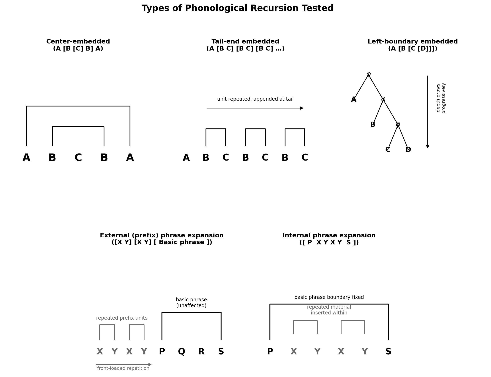

# Sequence-Level Recursion in Nonhuman Vocal Communication

Code and results for a comparative test of five recursion types — center-embedding,
tail-end embedding, left-boundary embedding, and external/internal phrase
expansion — across 43 species of bats, birds, primates, a pinniped, and two
cetaceans.

The full manuscript is in [`paper/Sequencerecursion_Michlich_09062026.pdf`](paper/Sequencerecursion_Michlich_09062026.pdf)
(download to view).



## Contents

- [Repository structure](#repository-structure)
- [Quick start](#quick-start)
- [Method summary](#method-summary)
- [Data and licensing](#data-and-licensing)
- [Citation](#citation)
- [License](#license)

## Repository structure

```
├── paper/
│   └── Sequencerecursion_Michlich_09062026.pdf   # the manuscript
├── src/
│   ├── call_detection.py            # bandpass + envelope + threshold onset detection
│   ├── recursion_pipeline.py        # feature extraction, clustering, ABA/tail/boundary tests
│   ├── new_expansion_tests.py       # external (prefix) and internal phrase expansion tests
│   ├── run_statistical_tests.py     # convenience wrapper: run all 5 tests on one sequence
│   ├── fdr_correction.py            # Benjamini-Hochberg correction
│   └── pgls_analysis.py             # naive OLS vs. PGLS regression
├── data/
│   ├── derived/
│   │   ├── all_recursion_FINAL.csv      # per-file results, all 3 full-scale tests, 43 species
│   │   ├── expansion_tests_ALL.csv      # per-file results, 2 expansion tests, 9 species
│   │   ├── sample_call_events.csv       # example call onset/offset timestamps (non-Xeno-canto species)
│   │   └── sample_cluster_labels.csv    # example k-means cluster-type labels (non-Xeno-canto species)
│   └── citations/
│       ├── data_citations.csv           # paper + dataset citation for every non-Xeno-canto species
│       └── xeno_canto_citations.csv     # recordist + catalog number for every Xeno-canto recording used
├── phylogeny/
│   ├── phylo_tree_v5.nwk            # composite phylogeny, Newick format
│   ├── phylo_cov_matrix_v5.npy      # precomputed Brownian-motion covariance matrix
│   ├── phylo_labels_v5.txt          # species labels matching the covariance matrix's row/col order
│   └── pgls_results_v5.json         # cached regression output
└── figures/                          # all figures used in the paper, as standalone PNGs
```

## Quick start

```bash
pip install -r requirements.txt
cd src

# Reproduces Table 1 / the FDR paragraph in Results
python fdr_correction.py

# Reproduces Figure 7 / the phylogenetic correction paragraph in Results
python pgls_analysis.py

# Validates all five tests on synthetic data (null + positive control checks)
python run_statistical_tests.py
```

To run the tests on your own recordings: detect call onset/offset times (see
`call_detection.py`, or use existing expert annotation), assign each call a
type label (via real annotation, or via `recursion_pipeline.extract_features`
+ `cluster_types` for unsupervised clustering), and pass the resulting label
sequence to `run_statistical_tests.run_all_tests()`.

```python
from run_statistical_tests import run_all_tests

sequence = ['A', 'B', 'A', 'C', 'B', 'A', 'C', 'C', 'B', ...]  # call types, in order
results = run_all_tests(sequence)
print(results['aba']['z'], results['aba']['p'])
```

## Method summary

Five recursion types were tested, each against a null distribution built
from 2,000 random permutations of the same call-type sequence:

- **Center-embedding**: symmetric A...B...A bracketing (count of immediate ABA triplets)
- **Tail-end embedding**: a unit repeated and appended to a sequence (count of immediately-repeated bigrams)
- **Left-boundary embedding**: progressively deepening nesting around a recurring anchor (trend in gap size between anchor occurrences)
- **External (prefix) phrase expansion**: repeated material concentrated in the first third of a sequence
- **Internal phrase expansion**: repeated material concentrated in the middle third of a sequence

Center-embedding, tail-end embedding, and left-boundary embedding were tested
at full scale (223 files, 43 species). External and internal phrase expansion
were tested on a subset of 82 files spanning 9 species. Full definitions,
validation procedure, and results are in the paper.

## Data and licensing

This is a compiled, secondary analysis: no new field recordings were made.
Every recording used was sourced either from Xeno-canto or from an existing
published dataset, and full attribution for each is in `data/citations/`.

This repository provides the analysis **code** and the **aggregate,
per-file results** (z-scores and p-values) that feed directly into the paper.
For the species not sourced from Xeno-canto, `data/derived/` also includes a
small sample of per-call metadata (`sample_call_events.csv`,
`sample_cluster_labels.csv`) so the intermediate structure of the pipeline is
visible end-to-end. Full per-call metadata is not included for every species,
since some source recordings carry licenses that restrict redistribution of
derived data; anyone wanting the complete per-call data for a given species
can regenerate it directly from that species' cited source audio using the
code in `src/`.

## Citation

If you use this code or the results table, please cite the paper (see
`paper/`) and, for any individual species' underlying audio data, the
original dataset per `data/citations/data_citations.csv` or
`data/citations/xeno_canto_citations.csv` and Michlich, J. M. (2026). 
Nonhuman-animal-recursion v.1.0.1 (Version v1.0.1) [Computer software]. 
Zenodo. https://doi.org/10.5281/zenodo.22543829


## License

Code in `src/` is provided under the MIT License (see `LICENSE`). This does
not extend to any audio data referenced in `data/citations/`, which remains
under each original dataset's own license terms.
